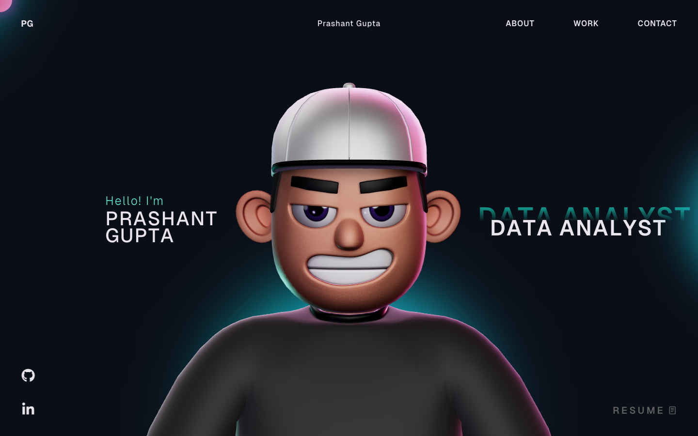

# Prashant Gupta - Data Professional Portfolio 🚀

**Data Analyst | Computer Engineer**

📍 Navi Mumbai, India  
📧 prashantgtx@gmail.com  
Portfolio: [prashant-gtx.github.io](https://prashant-gtx.github.io/)  
🔗 [LinkedIn](https://www.linkedin.com/in/prashant-gtx/) • [GitHub](https://github.com/prashant-gtx)

This is the interactive, 3D portfolio website for **Prashant Gupta**.  
Check out the live website here: [https://prashant-gtx.github.io](https://prashant-gtx.github.io)

## 📸 Snapshot

---

## 🌟 About Me  
Versatile data professional with strong foundations in data analysis, data engineering, and applied machine learning. Experienced in building end-to-end data pipelines, performing EDA, developing dashboards, and enabling data-driven decision-making. Practical experience with big data tools, cloud platforms, and AI systems including LLMs and RAG. Skilled in transforming raw, large-scale data into reliable analytics solutions and intelligent applications.

---

## 🛠️ Skills  

### Programming & Databases
- **Python**: NumPy, Pandas, Matplotlib, Seaborn, BeautifulSoup, Regex (re)
- **SQL**: Joins, CTEs, Window Functions
- **R**, **Java**
- **PostgreSQL**

### Data Analysis & Visualization
- **Power BI**, **Excel**, **Tableau**, **DAX**
- Data Visualization & Dashboarding

### Big Data, Cloud & Tools
- **Big Data**: PySpark, SparkSQL, Apache Hive, Hadoop, Kafka
- **Cloud/OS**: AWS, Linux, Databricks
- **Tools**: n8n, Git, Docker

## 🎯 Interests
- Traveling, Singing, Cooking, Multi-Lingual content consumption

---

## 📂 Projects  

### MarketPulseAI | [GitHub](https://github.com/prashant-gtx)
- Developed a real-time financial intelligence platform with a **FastAPI** backend to aggregate financial news, market data, and analytics.
- Engineered an **Agentic Retrieval-Augmented Generation (RAG)** pipeline using **ChromaDB** and **Llama 3.2**, featuring a self-healing mechanism that refreshes stale context from Yahoo Finance.
- Designed a privacy-first AI workflow by running local LLMs (**Ollama**) for offline news summarization and integrated **FinBERT** for real-time sentiment analysis.
- Built a scalable data ingestion system using concurrent background scrapers and an **APScheduler**-driven alert engine.

### Detecting Early Stage Knee Osteoarthritis Using Deep Transfer Learning | [GitHub](https://github.com/prashant-gtx)
- Built a deep learning pipeline to classify knee X-ray images into five severity grades (0-4), enabling early detection of osteoarthritis.
- Leveraged transfer learning by fine-tuning **ResNet** and **VGG** architectures.
- Addressed class imbalance using selective augmentation and iterative model refinement.
- Built an interactive **Streamlit** web application for uploading X-rays and viewing diagnostic reports.

### Consumer Lending Risk Insights Through Data Analytics | [GitHub](https://github.com/prashant-gtx)
- Analyzed consumer loan application and historical repayment data to identify key factors influencing loan default risk.
- Performed EDA and feature engineering to distinguish defaulters from non-defaulters.
- Conducted statistical hypothesis testing to validate risk drivers such as age, income, and debt-to-income ratio (DTI).
- Translated analytical findings into actionable credit policy recommendations.

---

## 🎓 Education  

- **PG Diploma in Big Data Analytics**  
  *Centre for Development of Advanced Computing (C-DAC), Mumbai* | Aug 2025 - Feb 2026  
  **Score**: 80.63%

- **Bachelor of Engineering – Computer Engineering**  
  *SIES Graduate School of Technology* | Dec 2021 - May 2025  
  **CGPA**: 7.51

- **Class XII (CBSE)**  
  *DAV Public School, Nerul* | May 2020 - May 2021  
  **Score**: 84%

- **Class X (CBSE)**  
  *DAV Public School, Nerul* | May 2018 - May 2019  
  **Score**: 90.40%

---

## 🏆 Certifications & Achievements
- **Career Essentials in Data Analysis** – Microsoft & LinkedIn
- **SQL (Basic, Intermediate, Advanced)** – HackerRank
- **AWS Academy Graduate** – Data Engineering
- **AWS Academy Graduate** – Cloud Foundations
- **Data Engineering with Hadoop and Spark** – GeeksforGeeks

---

## 💼 Positions of Responsibility

- **Administration Head** – IEEE SIES GST
  - Coordinated 10+ events with cross-functional teams.
  - Streamlined administrative processes, reducing setup time by 30%.
- **NSS Volunteer**
  - Contributed to multiple community programs related to cleanliness drives and awareness campaigns.

---

## 💻 Portfolio Tech Stack (Under the Hood)
The interactive 3D portfolio is built with the following modern web technologies:
- **Frontend Framework**: React, TypeScript, HTML, CSS, JavaScript
- **3D Rendering**: ThreeJS, WebGL, React Three Fiber, React Three Drei
- **Animations**: GSAP (GreenSock Animation Platform)

---

## 📞 Contact  
Want to collaborate, chat about data, or explore potential opportunities?  
Feel free to reach out!  
📧 prashantgtx@gmail.com  
📞 +91-9029140773  

---

© All rights reserved.
